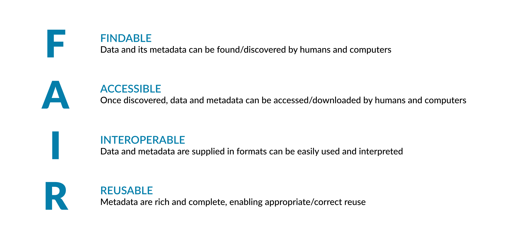

---
title: FAIR guiding principles
teaching: 40
exercises: 10
questions:
- What is FAIR? 
- Why is FAIR important?
- Pillars of FAIR
objectives:
- Identify the importance of FAIR principles for the open science
- Explain The difference between FAIR and open data
- Contextualise the main principles of FAIR in the light of the main pillars (Identifiers, access, metadata, and registration)
keypoints:
- FAIR stands for Findable, Accessible, Interoperable and Reusable
- What is meant by FAIRness and FAIRification of data?
- Metadata, identifiers , registration, access are key components in the process of FAIRification
- The FAIR Principles differ from Open data because they permit the owner of the data to control access, although as part of this they are required to define methods and instances where data could be accessed
--- 
##### What is FAIR?
The FAIR Principles were created to help researchers share, reuse, and manage their data. These Principles will be discussed and contextualised later, but for now, you should know that FAIR data can be defined as any dataset that can be discovered and downloaded by others; and interpreted correctly through detailed descriptions of the provision of detailed descriptions about the data.

 
FAIR is not limited to the Life Sciences and spans all research disciplines. The FAIR principles are also not limited to data and can be applied to the sharing and reuse of services, software, training and data workflows. 
##### The history of FAIR and its use today
A report from the European Commission Expert Group on FAIR data describes the origins of FAIR and its development in 2014-2015 by a FORCE11 Working Group.  
FAIR is an acronym relating to a “thing” that is made Findable, Accessible, Interoperable and Reusable.   For FAIR data, the “thing” we refer to is the data.  For a script or analysis workflow, the thing would be “software”.
FAIR itself was then formalised and published in 2016 in FAIR Guiding Principles for scientific data management and stewardship.

> ## Exercise
> Read page 11 of the European Commission report, under the heading “Origins and definitions of FAIR”.  What 
> benefit did the FORCE11 Working Group see to coining the word FAIR? 
{: .challenge}

> ## Solution
> The report states: “a FORCE11 Working Group coined the FAIR data definition, latching onto an arresting and
> rhetorically useful acronym. The wordplay with fairness, in the sense of equity and justice, has also been 
> eloquent in communicating the idea that FAIR data serves the best interests of the research community and 
> the advancement of science as a public enterprise that benefits society. ”
{: .solution}

> ## Exercise
> FAIR is not limited to data. From [the same report](https://zenodo.org/record/1285272#.Yuk8O_HMIqt), what other examples of “objects” can be made FAIR? 
> ## Solution:
> On page 15, the report states: “FAIR should be applied broadly to all objects (including metadata, identifiers, software and DMPs) that are essential to the practice of research, and should inform metrics relating directly to these > objects.”  Noting that DMPs are “data management plans”.
> Also, on page 34 "FAIR data, code, workflows, models, and other digital research objects"”
> The benefits of FAIR data in research are evidenced in two publications given below as further reading.  In addition to these, familiarise yourself with two online FAIR resources: RDMkit and FAIR cookbook, that signpost and position FAIR concepts and its application.
> {: .solution}
{: .challenge}

- Further reading demonstrating the benefits of FAIR:
[A European Commission report in 2018](https://op.europa.eu/en/publication-detail/-/publicationd375368c-1a0a-11e9-8d04-01aa75ed71a1/language-en), considers the detrimental effects of not complying with FAIR principles and details the negative impact on research activities, collaboration, and innovation 
- [EMBL-EBI report in 2020](https://op.europa.eu/en/publication-detail/-/publicationd375368c-1a0a-11e9-8d04-01aa75ed71a1/language-en) shows how data sharing enabled the acceleration of COVID-19 > research to meet the challenges of the pandemic.
**What is meant by FAIRification and FAIRness of data?**
**FAIRification** is the process of making your data FAIR.  In other words, if you add metadata along with your data and share it, you are FAIRifying your data. We will take you through data FAIRification, in detail, later in this course but to put this into context now: by providing metadata along with your data when it is shared, you are FAIRifying your data.
The term **FAIRness** refers to the extent to which your data follows FAIR principles.
A common misconception is to think that for data to be FAIR it needs to be open. FAIR data and oOpen data are different

##### Open science and FAIR
The Open Data handbook states
Open data is “data that can be freely used, reused and redistributed by anyone.”
Hence, “Open data” refers to access without restriction.  While The term “open as possible, closed as necessary” is used commonly when describing FAIR data.
However, it is important to note, noting that most FAIR data is open without restriction, though FAIR data doesn’t require to be open and its access can be restricted.but access can be restricted in some cases.  So long as the conditions of access are given, the data remain FAIR even though not open.  The key is in thething is that there should be enough metadata – for a human or computer should be able to find the condition of access expressed in an explicit manner.

> ## Exercise: 
> Why would Open data be sometimes rejected by a clinician?
> 
>> ## Solution:
>> Although not limited to clinicians, researchers reject Open data where they produce and work with sensitive >> data or data subject to intellectual property.  Protecting sensitive data overrules mandating all research 
>> data should be open access.
>> Note though that in most cases, people following FAIR principles will be looking to share their data openly. Also, that sensitive data can be released through anonymisation and in many cases, sharing of sensitive data is subject to controlled access.  
> {: .solution}
{: .challenge}

##### Pillars of FAIR
The FAIR Principles refer to the terms: machine readability, metadata, persistent identifiers, access, and registration.  Before we start looking at real data examples that use the FAIR principles, we will define these first.

**Machine readability**
Machine readability refers to how data can be structured or formatted so that they can be processed or read by a computer.  A spreadsheet is a good example of machine-readable data, where each piece of data (number, word(s)) can be assigned a cell-address in the spreadsheet.  If a programmer knows that all data of a certain type (e.g. patient ID) are in the third column of a datasheet, a script can be written to easily retrieve all patient IDs.  Machine readability in FAIR is encountered later in this course when we consider how data can be discovered by computers.

>## Exercise:
>Read a little more about machine-readability in the Open Data Handbook.  What are the two key features of >machine-readability? https://opendatahandbook.org/glossary/en/terms/machine-readable/
>
>>## Solution:
>> Machine-readability not only refers to how data are structured, but also the format in which data are 
>> given. These are the two key features: structure and data format (formats such as CSV, enable machine-readability).
> {: .solution}
{: .challenge}

In the next lessons, we will explain to you:
- Metadata
- Persistent identifiers:
- Access
- Registration
