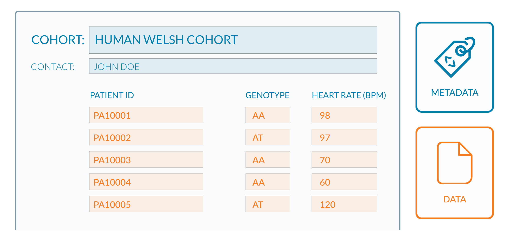
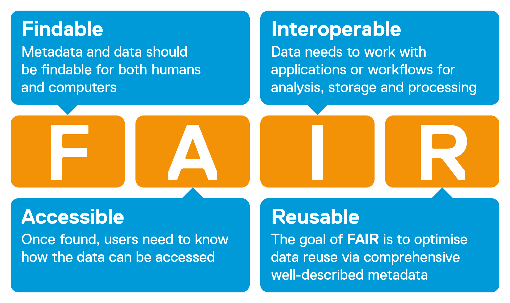
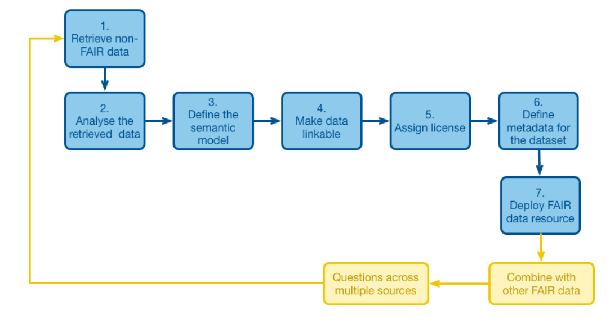

Contributers to this episodes are [Sara Morsy](https://www.bradford.ac.uk/staff/skhalil7), [Robert Andrews](https://www.cardiff.ac.uk/people/view/122749-andrews-robert)

The FAIR principles were created to help researchers share, reuse, and manage their data.  A common layperson's interpretation of FAIR data is a dataset that can be:
- discovered and downloaded by others; and
- interpreted correctly through the provision of detailed descriptions about the data.
Descriptions of data (metadata) enables appropriate reuse.  This is similar to other aspects of published research, such as figures in papers, where titles and notes are given as well as descriptions of axes where data are plotted.  The provision of metadata is key to FAIR.

Note that FAIR is not limited to the Life Sciences and spans across all research disciplines. Additionally, applying FAIR principles is not limited to data, but can be applied to the sharing and reuse of software and data workflow. 
## So, what is FAIR?
FAIR is an acronym summarising the 4 principles of data being: 
- **F**indable
- **A**ccessible
- **I**nteroperable
- **R**esuable

https://www.scibite.com/solutions/enterprise-fair-data-mdm/

To apply FAIR to your data (and metadata), each principle has a subset of specific requirements that can be used as a checklist.  Note, we put these into context later in this course when we take real datasets through FAIRification.  This checklist and further level of granularity is given in Nature 2016 publication [FAIR Guiding Principles for scientific data management and stewardship](https://doi.org/10.1038/sdata.2016.18)

> ## For further details on the FAIR Guiding Principles and learn through different examples, please see our RDMbites series:
> The powerpoint will be converted to video, please add your comments directly in the powerpoint. Your name will be added as a reviewer
> - [F in FAIR](https://docs.google.com/presentation/d/1RwEVZC390wtxPQM-zQsBDT7IbNVq0wpZ/edit#slide=id.p2)
> - [A in FAIR](https://docs.google.com/presentation/d/1RwEVZC390wtxPQM-zQsBDT7IbNVq0wpZ/edit#slide=id.p2)
> - [I in FAIR](https://docs.google.com/presentation/d/1Ac0qF1IKIVH2kjGmXFbyH0WAqI2vXqUB/edit#slide=id.p1)
> - [R in FAIR](https://docs.google.com/presentation/d/1uMyUGVH6mm48iDm6jNoBnAuqF3sGiTeO/edit?usp=sharing&ouid=115915105600833888129&rtpof=true&sd=true)
> 
{: .callout}

## What is meant by FAIRness and FAIRification of data?
FAIRfication is the process of making your data FAIR.  Since giving a unique identifier to your data is part of the first **Findability** principle, by doing so you are performing part of the FAIRification process.
FAIRness refers to the extent to which your data follows FAIR principles.  One way to achive this is by using a FAIR checklist, and measuring the extent of FAIRness through simply counting the number principles applied.
Data communities often have their own rules and interpretations of FAIRification of data.  As an example, here is a summary of the process provided by 
[GO-FAIR](https://www.go-fair.org/fair-principles/fairification-process/)

> ## Further reading and resources
> - FAIR guiding principles, [FAIRification workflow and examples](https://www.go-fair.org/fair-principles)
> - [FAIRification recipes in FAIRcookbook](https://faircookbook.elixir-europe.org/content/home.html)
{: .callout}

## The benefits of FAIR
FAIRification of your data enables reuse by yourself and others.  When grant writing, funders now commonly require a justificatoin of why new data are being generated as part of a study, in the context of reusing publically available data at no cost.
Additionally, FAIRification of your data will allow something called "machine readability" of you data, enabling time efficient analysis. Examples of machine readability include downloading public data using a single line of code in a script, instead of the lengthy process downloading via a webpage and moving into the relevant analysis folder.  
##### NNED AN IMAGE HERE DETAILING THIS.
Machine readability also ensures that search engines can find your data, thereby increasing its visibility. Based on a report by the EU, not complying with FAIR principles has detrimental effect at many levels including research activities, collaboration, and innovation. A recent report from EBI-EMBL has showed how proper data sharing improved the quality of COVID-19 research. 

> ## To know more about costs of not FAIRifying your data, Watch our RDMBites on costs of not FAIRifying your data
> [Powerpoint link of the RDMbites](https://docs.google.com/presentation/d/1xywEzC84RMor46moZVC-H-o3rJqEYYk1/edit#slide=id.p1)
{: .callout}

> ## In this research paper, the authors assessed the [cost/benefit relationship of the FAIRification process](https://doi.org/10.1162/dint_a_00109)
> Ebtisam Alharbi, Rigina Skeva, Nick Juty, Caroline Jay, Carole Goble; Exploring the Current Practices, Costs and Benefits of FAIR Implementation in Pharmaceutical > Research and Development: A Qualitative Interview Study. Data Intelligence 2021; 3 (4): 507–527. doi: 10.1162/dint_a_00109
> 
{: .keypoints}

## The misunderstandings of FAIR

**FAIR** data and **Open** data are different. As mentioned in [Open data handbook](http://opendatahandbook.org/guide/en/what-is-open-data/), open data is "data that can be freely used, reused and redistributed by anyone", which is often rejected by researchers where they have sensitive data or data subject to intellectual property.  In most cases, people following FAIR principles will be also be making their data open.  Sensitive data can be release through anonymisation.  
In many cases, sharing of sensitive data is subject to controlled access.  The FAIR Principles permit this by asking the owner of the data to define the methods by which controlled access operates and processes whereby data access could be requested.  The FAIR community use the phrase **“open as possible, closed as necessary”**
> ## Video
> <iframe width="560" height="315" src="https://www.youtube.com/embed/mVCDkhxxUgg" title="YouTube video player" frameborder="0" allow="accelerometer; autoplay; 
> clipboard-write; encrypted-media; gyroscope; picture-in-picture" allowfullscreen></iframe>
> 
{: .keypoints}

> ## References For further reading
>
> - https://www.go-fair.org/fair-principles/
> - https://faircookbook.elixir-europe.org/content/home.html
> - https://www.nature.com/articles/sdata201618
> 
{: .callout}
___
## Where does FAIR come from?
### The history of FAIR
A good overview of the origins of FAIR are given on page 11 of the 2018 "Turning FAIR data into reality: interim report" from the European Commission Expert Group on FAIR data (https://zenodo.org/record/1285272#.YshNncHMIqs).  The term FAIR originates from a 2014 FORCE11 Working Group, and in 2016 a Nature aricle was published with a specific focus on scientific data mangement and steweardship.  https://doi.org/10.1038/sdata.2016.18
The mention of FAIR data now appears routinely in the Life Sciences, including funder and gouverment literature .https://www.gov.uk/government/publications/open-research-data-task-force-final-report
### What data can be FAIRified?
Most data can be FAIRyfied. The ultimate goal of FAIR principles is that humans as well as machines can share and find other’s data by way of safe and quick access, interoperability and reuse. Any data from tools, workflows or algorithms that lead from input, output and objects can be FAIRyfied.

> # Further reading
> For more info about origins of FAIR see this (link)[https://zenodo.org/record/1285272#.Yp9oQHbMKUk]
> For further information about selecting your data, services and repositories for FAIRification see this (link)[https://zenodo.org/record/6345114#.YqDAsXbMKUk]
{: .callout}
___

