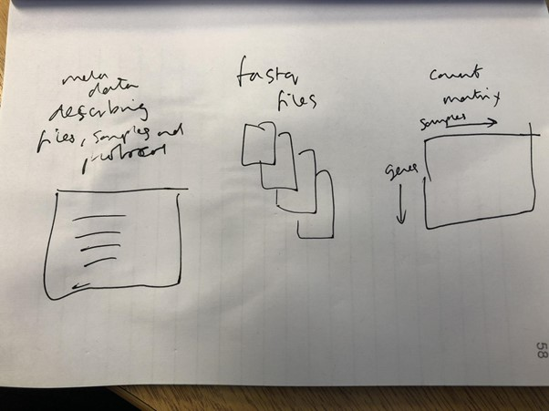
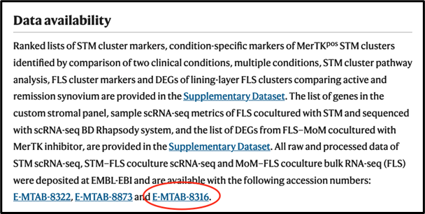
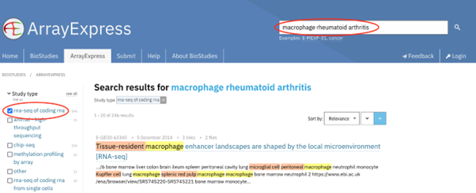
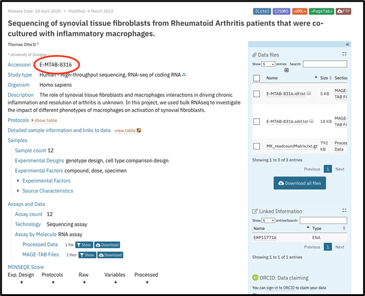
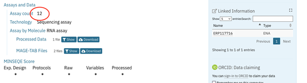
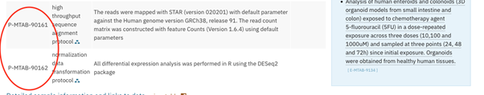
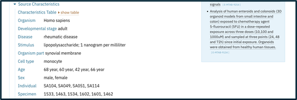
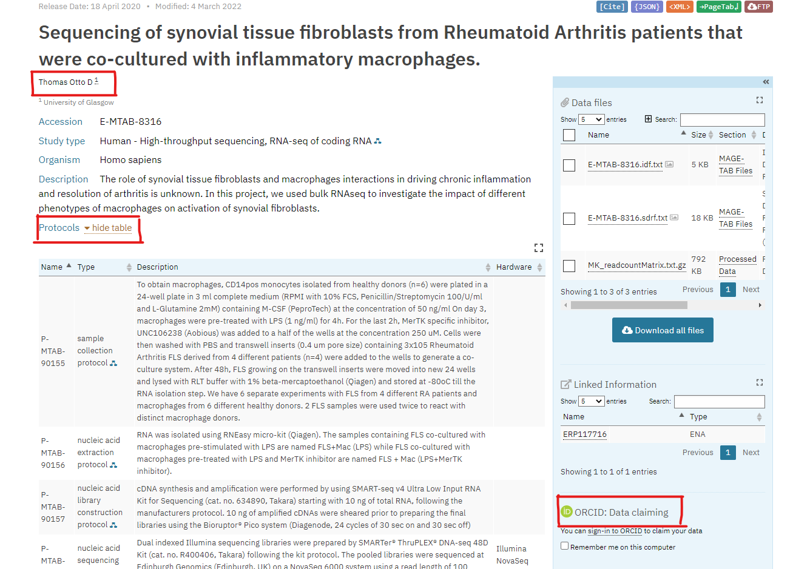

# FAIRification of a RNAseq dataset

[RNA sequencing](https://en.wikipedia.org/wiki/RNA-Seq) is chosen here as an example of how to FAIRify data for a popular assay in the Life Sciences. RNAseq data can be shared and curated in designated public repositories using established ontologies for describing protocols and biological material.

> ## FAIRification of RNAseq data can be best achieved through submitting your data to one of the 2 international repositories. 
> - ArrayExpress: [how to submit your data](https://www.youtube.com/watch?v=ANr2PTVy7JA)
> - (GEO database)[https://www.ncbi.nlm.nih.gov/gds]
> 
{: .callout}

By submitting your data, it is then openly archived, searchable and annotated with rich metadata.  Note, both repositories belong to the (FAIRsharing database registry)[https://fairsharing.org/search?fairsharingRegistry=Database] which can help you find public repositories for all types of Life Science data.
**This lesson will take you through a publicly available RNAseq dataset in ArrayExpress and show you how it meets FAIR principles using the [GO-FAIR checklist](https://www.go-fair.org) 
#### **The data and metadata for an RNAseq dataset:**

**Finding and Accessing an RNAseq dataset**
- (F1) (Meta)data are assigned a globally unique and persistent identifier.
- (F4) (Meta)data are registered or indexed in a searchable resource.
- (A1) (Meta)data are retrievable by their identifier using a standardised
communications protocol 
- (A1.1) The protocol is open, free, and universally implementable.

> ## Exercise
> Given the following publication, are you able to find the globally unique and persistent identifier for the RNAseq data and data descriptions (metadata)(F1)?
>[Link](https://doi.org/10.1038/s41591-020-0939-8)
{: .challenge}

> ## Answer
> Under “Data and code availability” I am told quote
> 
> Note, that the dataset unique and persistent (unchanging) identifier is E-MTAB-8316, and could also be expressed as
> [the fullURL](https://www.ebi.ac.uk/biostudies/ArrayExpress/studies/E-MTAB-8316)
> Note also that there are 2 other identifiers to 2 single cell RNAseq datasets.
{: .solution}

> ## Exercise
> Use the URL to access the dataset: 
> [https://www.ebi.ac.uk/biostudies/ArrayExpress/studies/E-MTAB-8316]
{: .challenge}

> Answer:
> You should see the following, nothing you have now accessed the RNAseq data using a weblink employing https.  Https is a standardised communications protocol that is open, free and universally implementable (A1 & A1.1)
{: .solution}

> ## Watch this video for more information
> https://www.youtube.com/watch?v=w0QbnxKRD0w
{: .discussion}

> ## Exercise
> Alternatively, use the search menu in ArrayExpress to find the same dataset
{: .challenge}

> ## Answer
> Use the following link to (access ArrayExpress)[https://www.ebi.ac.uk/biostudies/arrayexpress/studies/] and then use E-MTAB-8316 the search bar to access the 
> data.  Here data access is gained through searching a dataset 
> that is indexed in a searchable resource **(F4)**.  
> 
{: .solution}

> # Exercise
> Alternatively, use the search menu in ArrayExpress to search for the same dataset using the words “macrophage rheumatoid arthritis” and selecting “rna-seq of 
> coding rna” on the left-hand search bar.
{: .challenge}

> # Answer:
> Here, the dataset we want, is not the first in the list, but appears in the search results. Note that data access
> is gained through searching metadata(data about the experiment), and not the ID.  Here, FAIR is met through indexing metadata in a searchable resource (F4).
> 
{: .solution}

**Reading the metadata**
- (F2) Data are described with rich metadata 
- (F3) Metadata clearly and explicitly include the identifier of the data they describe

> ## Exercise:
> Find the unique, persistent identifier in the record:
> (https://www.ebi.ac.uk/biostudies/ArrayExpress/studies/E-MTAB-8316)
{: .challenge}

> ## Answer:
> It’s the first thing in the record.  All metadata (descriptions about the data) and the actual raw data files are linked from this page.  Here metadata clearly and > explicitly include the identifier of the data they describe **(F3)**.  

> Here data are described with rich metadata (F2).  This allows a person to reuse data appropriately by reducing ambiguity relating to what the data mean or how they are derived.  Additionally, rich metadata permits a person to search for dataset of interest, for example other RNAseq dataset featuring “macrophage rheumatoid arthritis”.
> Metadata is added by the person submitting the data and is further checked by a curator at the ArrayExpress database.  Metadata curation is performed via a web-based submission interface, which aids rich curation through linking to ontologies represented as webpage pulldowns. 
{: .solution}

> ## Exercise:
> (https://www.ebi.ac.uk/biostudies/ArrayExpress/studies/E-MTAB-8316)
> familiarise yourself with the page layout.  Noting there are links to all protocols, data, sample metadata and assay type.
> How many samples are in this dataset?
{: .challenge}

> ## Answer:
> 12 (assay count)
> 
{: .solution}

> ## Exercise
> What data provenance can you find? i.e. what processes have been performed to create the data linked from this page?
> Answer:
> The final 2 protocols detail all data transformations for the raw and transformed data.
> 
{: .solution}

#### Metadata and community standards

- (I1) (Meta)data use a formal, accessible, shared, and broadly applicable language for knowledge representation.
- (I2) (Meta)data use vocabularies that follow FAIR principles.
- (R1) (Meta)data are richly described with a plurality of accurate and relevant
Attributes. 
- (R1.3) (Meta)data meet domain-relevant community standards.

We have mentioned ontologies in the previous section.  In its simplest form, an ontology can be seen as a dictionary of terms you can use to annotate a piece of data.  For example, the NCBI taxonomy database is probably something you have used and can be viewed as a collection of organism names you can use to annotate species within a dataset.  An ontology, though, will also define relationships between terms.  So in the taxonomy example, the term “Homo sapiens” will belong to parent terms such as  Primate, Mammal and so on.  Importantly, by using an ontology you can ensure you are using interoperable and searchable terms with your data.

Published ontologies are linked from the ArrayExpress submission tool, so this work is done for you.  ALthough, if you wish to start using ontologies to annotate your data at the point it is produced, the [FAIRsharing Standards registry] (https://fairsharing.org/search?fairsharingRegistry=Standard)  is a place to start.  Importantly, when an ontology is published it itself becomes findable and reusable in the context of the FAIR principals **(I2)**.

Metadata using published ontologies permit interoperability since you can match identical annotations across data and databases **(I1 & I2)**.  Additionally, they can be understood by communities of practice **(R1, R1.3)**.

> ## Exercise
> Look at the page again. Identify any metadata that belongs to an existing, published ontology.   Note, we have mentioned one already: “Homo sapiens” as part of 
> (taxonomy)[https://www.ncbi.nlm.nih.gov/taxonomy].
{: .challenge}

>## Answer
> OK …. There are many.  There are more metadata annotations than there are free texts. There are obvious ontologies under Source Characteristics such as “Developmental stage”, Disease, Organism part, cell type... etc. These ontologies requested upon submission and depends on the type of your data and database. 
> 
> 
> 
> There are also others that are not so obvious.  Under “Protocols”, a protocol ontology is used under the column” type” as well as a hardware ontology under 
> “Hardware”.  By selecting the blue > node-and-edge icon next to the protocol type, you are taken to the 
> (Expertimental factor ontology)[https://www.ebi.ac.uk/ols/ontologies/efo] at the EBI.
> 
>
> {: .solution}
#### Data provenance

- (R1) (Meta)data are richly described with a plurality of accurate and relevant
Attributes. 
* (R1.1) (Meta)data are released with a clear and accessible data usage license.
* (R1.2) (Meta)data are associated with detailed provenance.

By using published ontologies following FAIR principles you can ensure metadata are described with appropriately licensed resources. Each database has its own licence, which users must follow while sharing or utilising the data.

> ## Exercise
> Look for the licensing options for (arrayexpress)[https://www.ebi.ac.uk/arrayexpress/]
{. :challenge}

> ## Answer
> Go to the bottom of the page, select licensing and it gets you to [here](https://www.ebi.ac.uk/licencing). You will notice that EBI uses CC license. 
> In our RDMBites about R in FAIR, we explained what are different types of copyright licences. Creative Commons is the most widely used and widely available free licencing model. There are four components to the licence that are arranged to give six licence options.
> For more detailed explanation, check (this link)[https://pitt.libguides.com/copyright/licenses]
> 
{. :solution}

> ## Exercise:
> What provenance can you find on this page?  i.e. information on where data came from.
{: .challenge}

> ## Answer:
> There are a couple of examples worth mentioning. Submitters name and option to submit ORCID ID, and protocols  describing the data and how it was produces. You will also notice the name of university where the data where produced. 
> 
{. :solution}

#### Downloading raw data for reuse
- (A1) (Meta)data are retrievable by their identifier using a standardised communications protocol. 
  - (A1.1) The protocol is open, free, and universally implementable.
- (I3) (Meta)data include qualified references to other (meta)data.
- R1. (Meta)data are richly described with a plurality of accurate and relevant attributes
* R1.1. (Meta)data are released with a clear and accessible data usage license
* R1.2. (Meta)data are associated with detailed provenance
* R1.3. (Meta)data meet domain-relevant community standards

These FAIR principles allow you and others to reuse raw data deposited in public database and do different types of secondary analysis.

For instance, in this dataset, Metadata can be downloaded from the MAGETAB link. Data can be downloaded from the ENA **(I3)**. The data and metadata are accurately described **(R)**. There is accession number at the top of the page that any person can use to easily retrieve the data **(A1)**

Even when raw data is not available, these data nonetheless adhere to FAIR principles, specifically **A2** metadata is accessible, even when the data is no longer available.

> ## Exercise:
> Identify how this GEO dataset aligned with FAIR principles? [GSE207314](https://www.ncbi.nlm.nih.gov/geo/query/acc.cgi?acc=GSE207314)
>
{. :challenge}

> ## Answer
> - F: the dataset is assigned a unique ID, the data are described with rich metadata, both data and metadata are indexed in public database (GEO database)
> - A: The dataset is accessible by a standardized communication protocol (https), you can download the data from different links available
> - I: The dataset made use of ontologies that were shared and understood by multiple researchers. You can also download the data and work on it using SRA tools
> - R: There is a clear description of data usage licence, for each sample, there is detailed description of protocols used which adhere to community standards. Each sample has its own unique ID
{. :solution}

___
## Making a “obscure” dataset FAIR (i.e. one without a metadata standard or public repository)
___
# Worked example three: making a piece of training material FAIR

**Overview**
Implementing FAIR principles in the context of Bioinformatics training is useful if not necessary to assure your material meet the cornerstone of open science practices. Ten guiding steps set up around the principles are wide ranging and apply to data, software and all aspects of training material, from slide presentations to exercises. It is therefore advisable to plan your training material with FAIR principles in mind from the outset.Full set of guidelines listed below (FAIRification process) are designed to get you thinking about what you need to do although the degree and context of individual application will vary from project to project.

# FAIRification process

1. Share      
As obvious as it sounds, sharing your training material will make its purpose hence shape the Fairness. Think about who to share it with, how to share it and to what extent. 

> ## Example:
> A short online course aimed exclusively at departmental staff and shared on Github.  
> 
> {: .challenge} 

2. Describe properly
Think about how the search engines will position your training material and what would aid clearer and faster find. 

> ## Example:
> Is the title accurately describing your project? Have you included relevant keywords?
> 
> {: .challenge}  

3. Give unique identity
Think about what unique identifiers will help others citing your work and give you credit for building the training material.

> ## Example:
> Common identifiers such as URLs and Persistent identifiers like Digital Object Identifier (DOI) and ORCID.
> 
> {: .challenge} 

4. Register online    
Think about a suitable training material repository where you can aggregate your data to be available to others. 

>  ## Example:
>  For instance Elixir Tess or YouTube.
> 
> {: .challenge} 

5. Define the access rules
Training material will vary according to for instance the sensitivity of data or paid memberships. 

> ## Example:
> Will it be full access or restricted access? Any restriction in access needs to be clear and simple and obvious to .> anyone searching for the data.
> 
> {: .challenge} 
 
6. Use interoperable format
The format used will only depend on how widely is used but also how data should be shared and read.

> ## Example:
> Consider pros and cons of different formats, for instance PDF vs PowerPoint.
> 
> {: .challenge} 

7. Make the material (re)usable for trainers
Think about what steps to take to allow your training material to be understood, reused and updated by other trainers. 

> ## Example:
> For instance, is your licence suitable for reuse? Is your material fully referenced?
>
> {: .challenge}   

8. Make useable for trainees
Put your pedagogic hat on in planning your material long term and long distance. Think about overcoming potential barriers of the lack of face-to-face teaching. Put yourself in the shoes of a trainee is setting expectations. 

> ## Example:
> Are your aims clearly stated? Is your material clearly structured? Have you opened your channels for support and 
> feedback? 
>
> {: .challenge}    
 
9. Welcome contributions
Think how to open your materials to others and state your principles of contribution. 

> ## Example: 
> For instance acknowledge the existing contributors and explain the merits to potential contributors.  
>
> {: .challenge}

10. Keep materials up to date
Keep the track of your versions and update your data regularly. Therefore, be clear if your materials are still valid and if not state what is out of date.

> ## Example:
> Are you using the newest version? Have you stored previous copies securely? Are your references and links up to date?
>
> {: .challenge}

For a complete set of instructions of FAIRifying a piece of training material watch the below RDMbite. 

https://docs.google.com/presentation/d/1th8aTNPq7ZCDGNGog10iCaVRE24rX9ZZRSz5ccTtE8g/edit#slide=id.p

> ## Keypoints:
> - Ten FAIR principles are applicable to a broad types of data, software and most training material. 
> - Applying FAIR to the training material will optimise the reuse of data, increase visibility of research and add to > saving of time and money. 
> {: .keypoints}

> ## Further reading:  
> https://www.ncbi.nlm.nih.gov/pmc/articles/PMC7241697/
> https://zenodo.org/record/5820221#.YqBtgnbMKUl
> 
> {: .keypoints}

