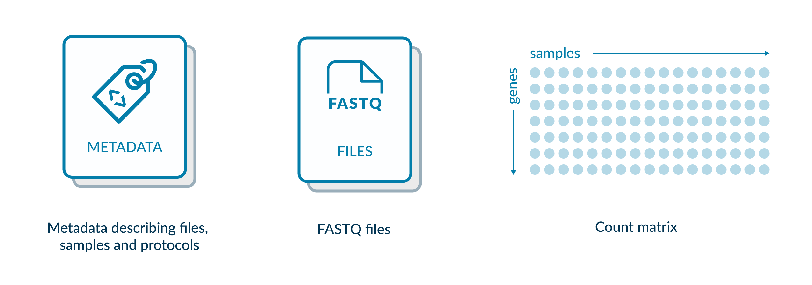

## FAIRification of a RNAseq dataset

[RNA sequencing](https://en.wikipedia.org/wiki/RNA-Seq) is chosen here as an example of how to FAIRify data for a popular assay in the Life Sciences. RNAseq data can be shared and curated in designated public repositories using established ontologies for describing protocols and biological material.

FAIRification of RNAseq data can be best achieved through submitting your data to one of the 2 international repositories. 
> - ArrayExpress: [how to submit your data](https://www.youtube.com/watch?v=ANr2PTVy7JA)
> - (GEO database)[https://www.ncbi.nlm.nih.gov/gds]

By submitting data to public repository, it is becomes openly accessible, searchable and annotated with rich metadata.  Note, both repositories belong to the (FAIRsharing database registry)[https://fairsharing.org/search?fairsharingRegistry=Database] which can help you find public repositories for all types of Life Science data.

**This lesson will take you through a publicly available RNAseq dataset in ArrayExpress and show you how it meets FAIR principles using the checklist published by [GO-FAIR](https://www.go-fair.org) 

## Describing the data and metadata for an RNAseq dataset

We will use the following human RNAseq dataset for this practical: [E-MTAB-8316](https://www.ebi.ac.uk/biostudies/ArrayExpress/studies/E-MTAB-8316).  THis hosts all metadata and links to downloadable raw and transformed data.

## Finding and accessing an RNAseq dataset

In this section, the following FAIR Guiding Princples are discussed:
- **(F1) (Meta)data are assigned a globally unique and persistent identifier**
- **(F4) (Meta)data are registered or indexed in a searchable resource**
- **(A1) (Meta)data are retrievable by their identifier using a standardised communications protocol**
- **(A1.1) The protocol is open, free, and universally implementable**

> ## Exercise
> The RNAseq dataset we looking at is part of a publication in Nature Medicine, [Link](https://doi.org/10.1038/s41591-020-0939-8).  By selecting this link, can you find the globally unique and persistent identifier for the RNAseq data and data descriptions (metadata)?
> **(F1) (Meta)data are assigned a globally unique and persistent identifier**
>[Link](https://doi.org/10.1038/s41591-020-0939-8)
{: .challenge}

> ## Solution
> Under “Data and code availability” I am told the following.
> 
> Note, that the dataset unique and persistent (unchanging) identifier is E-MTAB-8316, and could also be expressed as
> [the fullURL](https://www.ebi.ac.uk/biostudies/ArrayExpress/studies/E-MTAB-8316)
> Note that there are 2 other identifiers given to 2 single cell RNAseq datasets.  For the purpose of this lesson, we are only considering the bulk RNAseq dataset.
{: .solution}

> ## Exercise
> Use a URL to access this dataset.  This URL is a concatenation of the URL of the data repository and the unique identifier: [https://www.ebi.ac.uk/biostudies/ArrayExpress/studies/E-MTAB-8316] 
> **(A1) (Meta)data are retrievable by their identifier using a standardised communications protocol**
> **(A1.1) The protocol is open, free, and universally implementable** **
{: .challenge}

> ## Solution
> You should see the following webpage hosted at the EBI(www.ebi.ac.uk).  In the context of FAIR, this means you have now accessed this RNAseq data using a weblink employing https, where https is a standardised communications protocol ("data getting method") that is open, free and universally implementable.
> 
{: .solution}

> ## Exercise
> Alternatively, use the search menu in ArrayExpress to find the same dataset.  Use the following link to (access ArrayExpress)[https://www.ebi.ac.uk/biostudies/arrayexpress/studies/] and then type E-MTAB-8316 into the search bar.
> **(F4) (Meta)data are registered or indexed in a searchable resource**
{: .challenge}

> ## Solution:
> Note here that data access is gained through searching the database, and not via a direct URL.  In the context of FAIR, this RNAseq dataset is indexed in a searchable resource **(F4)**.  
> 
>
{: .solution}

> ## Exercise
> Alternatively, use the same search menu in ArrayExpress to search again for the same dataset using the words “macrophage rheumatoid arthritis” and selecting “rna-seq of coding rna” on the left-hand search bar.
> **(F4) (Meta)data are registered or indexed in a searchable resource**
{: .challenge}

> ## Solution:
> Here, the dataset we are using is not the first in the list, but appears in later in the search results.  Note that data access
> is gained through searching metadata (data about the experiment), and not the ID, in this example.**(F4)**.  
> 
{: .solution}

## Learning about the experiment and dataset from reading the metadata

In this section, the following FAIR Guiding Princples are discussed:
- **(F1) (Meta)data are assigned a globally unique and persistent identifier**
- **(F2) Data are described with rich metadata**
- **(F3) Metadata clearly and explicitly include the identifier of the data they describe**

> ## Exercise:
> Start looking at the dataset webpage.  Try to find the unique, persistent identifier in the record:
> (https://www.ebi.ac.uk/biostudies/ArrayExpress/studies/E-MTAB-8316)
> **(F1) (Meta)data are assigned a globally unique and persistent identifier**
{: .challenge}

> ## Answer:
> THe persistent identifier is circles in red, and the first thing in the record. **(F1)**.  All metadata (descriptions about the data) and the actual raw data files are linked from this page.  Here metadata clearly and explicitly include the identifier of the data they describe **(F3)**.  
> 
> Here data are described with rich metadata **(F2)**, which allows a person to reuse data appropriately by reducing ambiguity around what the data mean or how they are derived. 
{: .solution}

Note that rich metadata allows enables a person to search for dataset of interest, since it is indexed and made searchable by ArrayExpress.
Metadata is added by the person submitting the data and is further curated by the ArrayExpress database.  Metadata curation is performed via a web-based submission interface, which aids rich curation through linking to ontologies represented as webpage pulldowns. 

> ## Exercise:
> (https://www.ebi.ac.uk/biostudies/ArrayExpress/studies/E-MTAB-8316)
> familiarise yourself with the page layout.  Noting there are links to all protocols, data, sample metadata and assay type.
> How many samples are in this dataset?
{: .challenge}

> ## Answer:
> 12 (assay count)
> 
{: .solution}

> ## Exercise
> What data provenance can you find? i.e. what processes have been performed to create the data linked from this page?
{: .challenge}

> ## Answer:
> The final 2 protocols detail all data transformations for the raw and transformed data.
> 
{: .solution}

#### Metadata and community standards
Also you need to check if your metadata adhere to your community standards, you can check the following principles if they are fulfilled or not:
- (I1) (Meta)data use a formal, accessible, shared, and broadly applicable language for knowledge representation.
- (I2) (Meta)data use vocabularies that follow FAIR principles.
- (R1) (Meta)data are richly described with a plurality of accurate and relevant
Attributes. 
- (R1.3) (Meta)data meet domain-relevant community standards.

We have mentioned ontologies in the previous section.  In its simplest form, an ontology can be seen as a dictionary of terms you can use to annotate a piece of data.  For example, the NCBI taxonomy database is probably something you have used and can be viewed as a collection of organism names you can use to annotate species within a dataset.  An ontology, though, will also define relationships between terms.  So in the taxonomy example, the term “Homo sapiens” will belong to parent terms such as  Primate, Mammal and so on.  Importantly, by using an ontology you can ensure you are using interoperable and searchable terms with your data.

Published ontologies are linked from the ArrayExpress submission tool, so this work is done for you.  ALthough, if you wish to start using ontologies to annotate your data at the point it is produced, the [FAIRsharing Standards registry] (https://fairsharing.org/search?fairsharingRegistry=Standard)  is a place to start.  Importantly, when an ontology is published it itself becomes findable and reusable in the context of the FAIR principals **(I2)**.

Metadata using published ontologies permit interoperability since you can match identical annotations across data and databases **(I1 & I2)**.  Additionally, they can be understood by communities of practice **(R1, R1.3)**.

> ## Exercise
> Look at the page again. Identify any metadata that belongs to an existing, published ontology.   Note, we have mentioned one already: “Homo sapiens” as part of 
> (taxonomy)[https://www.ncbi.nlm.nih.gov/taxonomy].
{: .challenge}

> ## Answer
> There are more metadata annotations than there are free texts. There are obvious ontologies under Source Characteristics such as “Developmental stage”, Disease, Organism part, cell type... etc. These ontologies requested upon submission and depends on the type of your data and database. 
> 
> There are also others that are not so obvious.  Under “Protocols”, a protocol ontology is used under the column” type” as well as a hardware ontology under 
> “Hardware”.  By selecting the blue > node-and-edge icon next to the protocol type, you are taken to the 
> (Expertimental factor ontology)[https://www.ebi.ac.uk/ols/ontologies/efo] at the EBI.
> 
>
{: .solution}
#### Data provenance
The phrase "data provenance" denotes a record that explains how and why a piece of data (in a database, document, or repository) are produced. Metadata is considered one of these records. To align with FAIR guideline and maintain good practice of data provenance. 

- (R1) (Meta)data are richly described with a plurality of accurate and relevant
Attributes. 
* (R1.1) (Meta)data are released with a clear and accessible data usage license.
* (R1.2) (Meta)data are associated with detailed provenance.

By using published ontologies following FAIR principles you can ensure metadata are described with appropriately licensed resources. Each database has its own licence, which users must follow while sharing or utilising the data.

> ## Exercise:
> Look for the licensing options for (arrayexpress)[https://www.ebi.ac.uk/arrayexpress/]
> {: .source}
{: .challenge}

> ## Answer:
> Go to the bottom of the page, select licensing and it gets you to [here](https://www.ebi.ac.uk/licencing). You will notice that EBI uses CC license. 
> In our RDMBites about R in FAIR, we explained what are different types of copyright licences. Creative Commons is the most widely used and widely available free licencing model. There are four components to the licence that are arranged to give six licence options.
> For more detailed explanation, check (this link)[https://pitt.libguides.com/copyright/licenses]
> {: .source}
{: .solution}

> ## Exercise:
> What provenance can you find on this page?  i.e. information on where data came from.
> {: .source}
{: .challenge}

> ## Answer:
> There are a couple of examples worth mentioning. Submitters name and option to submit ORCID ID, and protocols  describing the data and how it was produces. You 
> will also notice the name of university where the data where produced. 
> 
> {: .source}
{: .solution}

#### Downloading raw data for reuse
One of the benefits of FAIR, it makes your data reusable which will also allows reproducibility of your research. Thus, these principles in FAIR should be fulfilled. These FAIR principles allow you and others to reuse raw data deposited in public database and do different types of secondary analysis.
- (A1) (Meta)data are retrievable by their identifier using a standardised communications protocol. 
  - (A1.1) The protocol is open, free, and universally implementable.
- (I3) (Meta)data include qualified references to other (meta)data.
- R1. (Meta)data are richly described with a plurality of accurate and relevant attributes
* R1.1. (Meta)data are released with a clear and accessible data usage license
* R1.2. (Meta)data are associated with detailed provenance
* R1.3. (Meta)data meet domain-relevant community standards

For instance, in this dataset, Metadata can be downloaded from the MAGETAB link. Data can be downloaded from the ENA **(I3)**. The data and metadata are accurately described **(R)**. There is accession number at the top of the page that any person can use to easily retrieve the data **(A1)**

Even when raw data is not available, these data nonetheless adhere to FAIR principles, specifically **A2** metadata is accessible, even when the data is no longer available. 

> ## Exercise:
> Identify how this GEO dataset aligned with FAIR principles? [GSE207314](https://www.ncbi.nlm.nih.gov/geo/query/acc.cgi?acc=GSE207314).
> 
{: .challenge}

> ## Answer:
> - F: the dataset is assigned a unique ID, the data are described with rich metadata, both data and metadata are indexed in public database (GEO database)
> - A: The dataset is accessible by a standardized communication protocol (https), you can download the data from different links available
> - I: The dataset made use of ontologies that were shared and understood by multiple researchers. You can also download the data and work on it using SRA tools
> - R: There is a clear description of data usage licence, for each sample, there is detailed description of protocols used which adhere to community standards. 
> Each sample has its own unique ID
> 
{: .solution}

