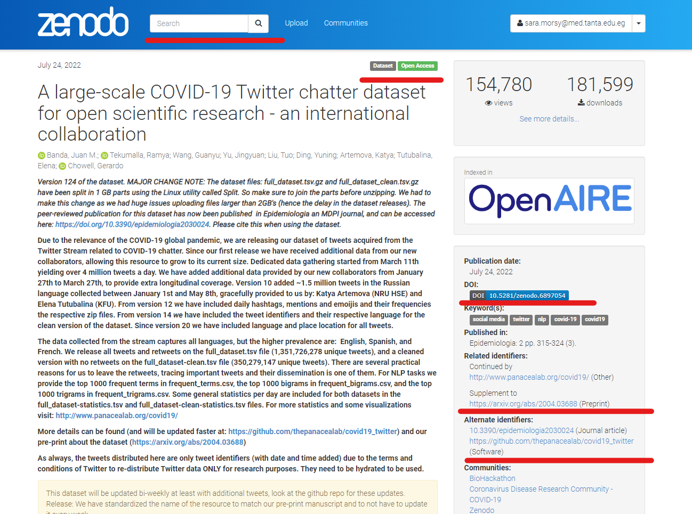
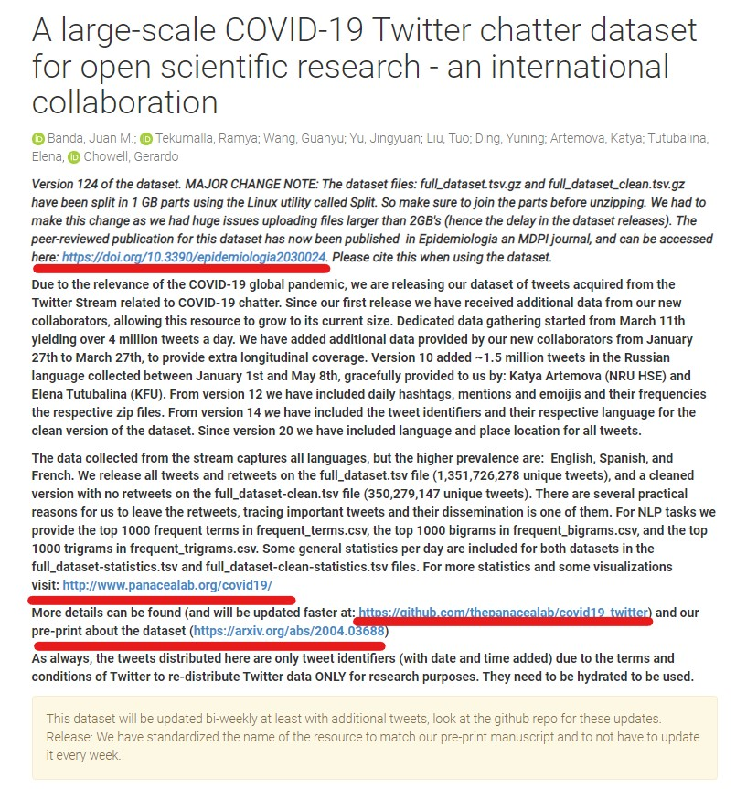
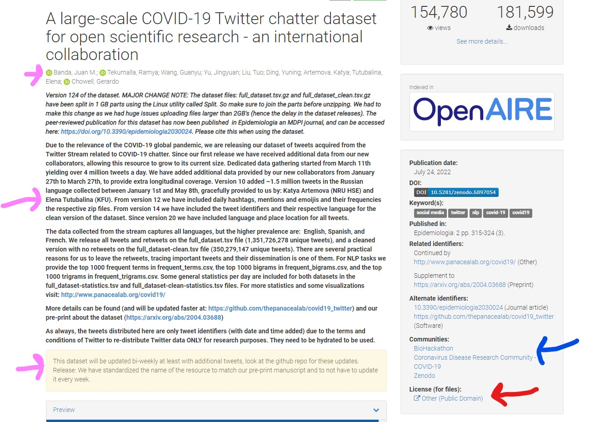

In this lesson, You will learn how to FAIRify your data in the absence of a public repository or when the data lacks a FAIRification protocol. You can accomplish this by uploading data to a public repository, which will assist you with the FAIRification process. 
Zenodo is one of these public repositories. Zenodo is a data platform that allows you to upload any type of data. When you upload your data to Zenodo, it becomes FAIR, and you can choose different access options (Remember the different access options with FAIR that we mentioned in "What is FAIR?" RDMbite) 

Zenodo's procedure is straightforward, with only three more steps. **Publish**, **Describe**, **Upload**
You can watch this 2-minute RDMbite to learn more about the procedure and get more specific information on how to create an account.

<iframe width="560" height="315" src="https://www.youtube.com/embed/Wrtfd8QPYOc" title="YouTube video player" frameborder="0" allow="accelerometer; autoplay; clipboard-write; encrypted-media; gyroscope; picture-in-picture" allowfullscreen></iframe>

--- 
### How does uploading your data to Zenodo will align with FAIR?
We will explain this to you through an example of this twitter dataset, you can access the link from [here](https://zenodo.org/record/6815967#.YuPHE3bMKUl). In this dataset, the authors collected tweets about COVID-19. They used NLP models to get these data. For more information, you can check this 
[link](https://www.mdpi.com/2673-3986/2/3/24)
#### Finding and accessing the dataset:
These FAIR principles will help make your dataset **findable** and **accessible**
- (F1) (Meta)data are assigned a globally unique and persistent identifier
- (F4) (Meta)data are registered or indexed in a searchable resource
- (A1) (Meta)data are retrievable by their identifier using a standardised communications protocol
- (A1.1) The protocol is open, free, and universally implementable

In Zenodo, any dataset has unique identifier (DOI), it is indexed in Zenodo so using DOI you can find it easily or instead you can use the search engines provided in any database or Zenodo itself. Please bear in mind that Zenodo is connected to other databases, that's why, data on Zenodo can be retrieved from other databases. 
Zenodo uses open API protocol and as we explained in the A in FAIR RDMbites, the access to data is not mediated through specialized proprietary tools or communication methods. Through this protocol, you and other researchers can easily access this data without any restriction

> ## Exercise
> Can you identify how the [dataset](https://zenodo.org/record/6815967#.YuPHE3bMKUl) we described previously aligns with the aforementioned FAIR principles?
{: .challenge}

> ## Solution
> you can see in this screenshot that **F1** is fulfilled through the following:
> -  DOI
> - other identifiers are also present
> - **A1** all of these identifiers are easily retrieved through URL. 
> - **F4** you can use Zenodo search engines to look for the data and also as you can see the data is also indexed in OpenAIRE
> 
{: .solution}
---
#### Learning about the experiment and dataset from reading the metadata
- (F1) (Meta)data are assigned a globally unique and persistent identifier
- (F2) Data are described with rich metadata
- (F3) Metadata clearly and explicitly include the identifier of the data they describe

Zenodo will always assign DOI for your data **F1**. The good thing about Zenodo metadata, it comes from DataCite Metadata Schema which iclude a list of core curated metadata for resource identification **F2**. In addition, the metadata of each record is linked to other DataCite servers allowing retrieval of your data. For datasets that do not have protocols, as you will see in our example, For **F3**, the authors are instructed to describe their data with rich metadata provided from DataCite Metadata Schema and enriched Zenodo metadata

> ## Exercise
> Can you identify how the [dataset](https://zenodo.org/record/6815967#.YuPHE3bMKUl) we described previously aligns with the aforementioned FAIR principles?
{: .challenge}

> ## Solution
> Since the dataset is not typical dataset and there is no community standard, you will not find the typical 
> metadata that you see in other databases we explained earlier.
> -  In this dataset, the author explained their metadata in details providing links to other resources, the 
> publication and description of how the data were generated
> 
> - **F3** you can see they cited the DOI of Zenodo in these links
> 
{: .solution}
---
#### Metadata and community standards
- **(A1) (Meta)data are retrievable by their identifier using a standardised communications protocol.**
- (A1.1) The protocol is open, free, and universally implementable.

As we explained before Zenodo uses open protocols that allow easy retrieval of the data. For instance, it uses REST API and OAI-PMH which are not restrictive protocols. The details of how these protocols works is outside the scope of our course but if you want to know more, please follow this (link)[https://developers.zenodo.org/]
- **(I3) (Meta)data include qualified references to other (meta)data.**

This is described easily on Zenodo (Please have a look on the next exercise to fully understand it)
- **R1. (Meta)data are richly described with a plurality of accurate and relevant attributes**

It is mandatory on Zenodo that you choose a specific number of Datacite terms to make sure that you have described your data adequately. It also provides you with a list of enriched terms
- R1.1. (Meta)data are released with a clear and accessible data usage license
Zenodo provides the uploader the ability to choose the licence they need for their data. You have the option to make your data fully open or restricted. 
- R1.2. (Meta)data are associated with detailed provenance
This one will be more clear in our example as you see here, the author provided detailed explanation of where, when, what and how they produced their data. 
- R1.3. (Meta)data meet domain-relevant community standards
During the upload process, you are provided with metadata that meets each community standard. You can also choose to publish your data in specific community collection. 

#### Data provenance
As we mentioned in RNAseq, data provenance explains how the data is generated. Uploading your data to Zenodo aligns with the following principles that helps you document the process of producing your data. 

- (R1) (Meta)data are richly described with a plurality of accurate and relevant Attributes.
- (R1.1) (Meta)data are released with a clear and accessible data usage license.
- (R1.2) (Meta)data are associated with detailed provenance.

> ## Exercise
> Can you identify how the [dataset](https://zenodo.org/record/6815967#.YuPHE3bMKUl) we described previously aligns with the aforementioned FAIR principles?
> 
{: .challenge}

> ## Solution
> As you see here, the metadata here is described in the details (Pink arrow), it describes the authors, how the data were generated, updated, links to the 
> publications and other collections (Pink arrow) **I3**
> For the licence, you can see the licence that authors choose for their data **R** (Red arrows)
> 
>
{: .solution}
