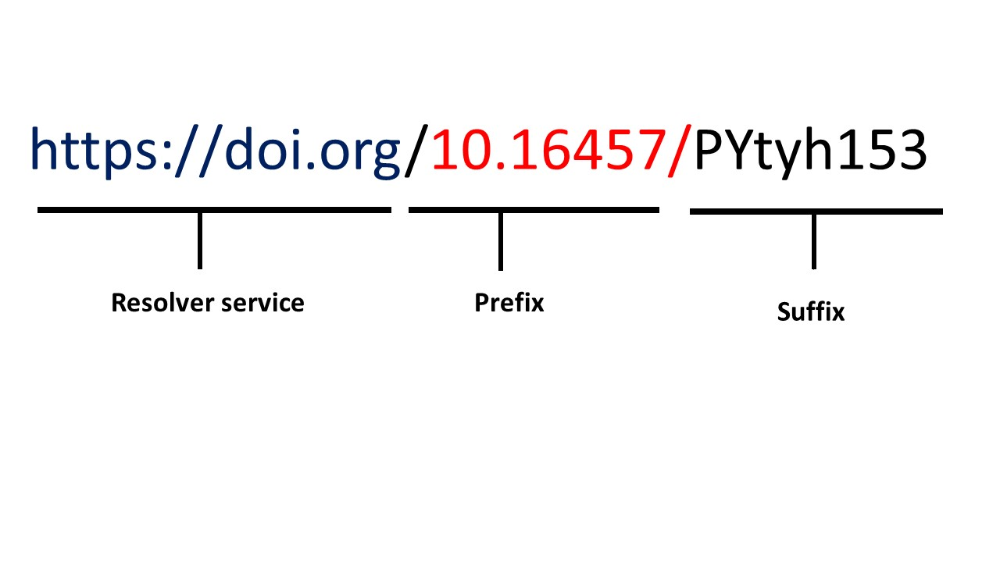

---
title: Persistent identifiers
teaching: 40
exercises: 10
questions:
- What is a persistant identifier?
- What is the structure of identifiers?
- Why it is important for your dataset to have an identifiers?
objectives:
- Explain the definition and importance of using identifiers
- Illustrate what are the persistent identifiers
- Give examples of the structure of persistent identifiers
keypoints:
- FAIR guiding principle adressed (I1) - (Meta)data use a formal, accessible, shared, and broadly applicable language for knowledge representation
- FAIR guiding principle adressed (I3) - (Meta)data include qualified references to other (meta)data
- FAIR guiding principle adressed (A2) - Metadata are accessible, even when the data are no longer available
--- 

## Persistent identifiers

Identifiers are an eternal reference to a digital resources such as datasets, metadata .. etc. They provide the information required to reliably identify, verify and locate your research data. Commonly, a persistent identifier is a unique record ID in a database, or a unique URL that takes a researcher to the data in question, in a database.

Persistent identifiers locate resources that may be a publication, dataset, or a person. Persistent identifiers have to be unique, globally, such that only one resource (dataset, person, etc) is identified by this identifier. Additional considerations may also be associated with specific types of identifier, such as the longevity of this presistence, as well as specific database policies that may affect turnover or link rot. 
Watch our RDMbBites on the persistent identifiers to understand more.   

Identifiers are a very important theme within the FAIR principles, arguably being foundational; they are considered one of the pillars for the FAIR principles, since they are crucial from the **Findable (F)** aspect.

**It is important to note that when you upload your data to a public repository, the repository will create this ID for you automatically.**

Based on [how to FAIR](https://howtofair.dk/how-to-fair/persistent-identifiers/), there are many resources that can help you know which databases will assign PID to your data. One of these resources is FAIR sharing, it provides you with a list of databases grouped by domains and organizations.

## The Structure of persistent identifiers

As you can see in this picture, the structure of any identifiers consist of 
- The initial resolver service: domain which is unique and specific to each community e.g. ORCID for researchers
- **Prefix**: Unique number that represent category e.g. for DOI specific numbers refer to the publisher and directory
- **Suffix**: The unique dataset number and it is unique under its prefix

> ## Exercise 1. Domain specific persistent identifiers
> Use [FAIRsharing](https://fairsharing.org) to find domain specific repository for plant genomics and phenotypes and explore the structure of its persistand identifiers?
>> ## Solution
>> If you follow the steps in the following screen recording, you will find plant genomics and phenotypes. In this database, all datasets are assigned digital object identifier (DOI)
>> <video src="../fig/vid1.mp4" controls="controls" style="max-width: 730px;">
>> </video>
>> The DOI is a persisitent identifiers that follows the structure we explained before
>> 
> {: .solution}
{: .challenge}

> ## Resources
> The resources listed below provide an overview of the information you need to know about identifiers.
> - [Unique and persistent identifiers](https://faircookbook.elixir-europe.org/content/recipes/findability/
> identifiers.html): this link provide a nice and practical explanation of the unique and persistent identifiers > from FAIRCookbook 
> 
> - [Identifiers](https://rdmkit.elixir-europe.org/identifiers.html): another nice explanation from RDMkit
> 
> - [Machine actionability](https://rdmkit.elixir-europe.org/machine_actionability): identifiers are also 
> important for machine readability, a nice explanation from RDMkit that describes machine readability
> 
> - Examples and explanation of different identifiers from FAIRsharing.org https://fairsharing.org/search?
> recordType=identifier_schema

{: .callout}

