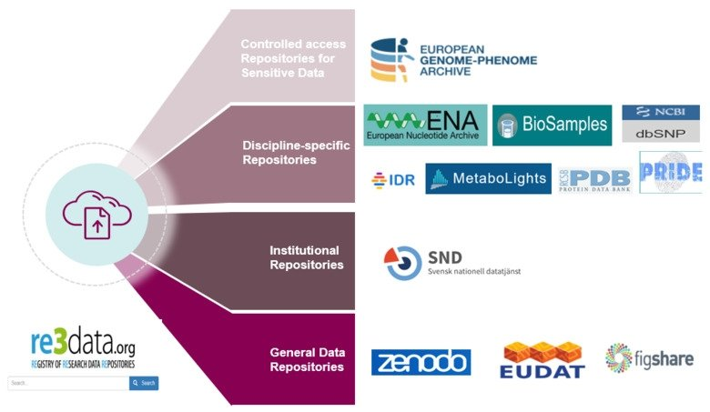
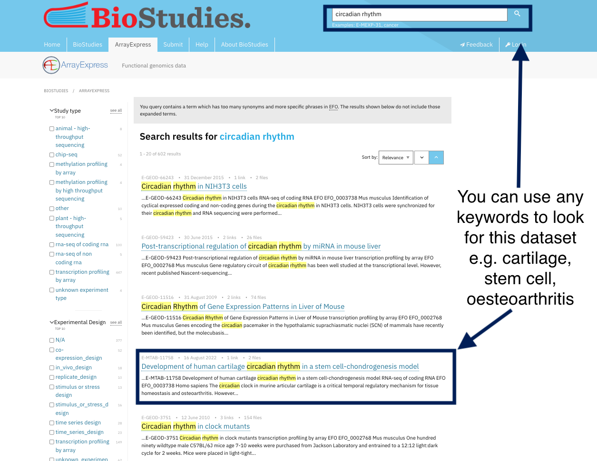
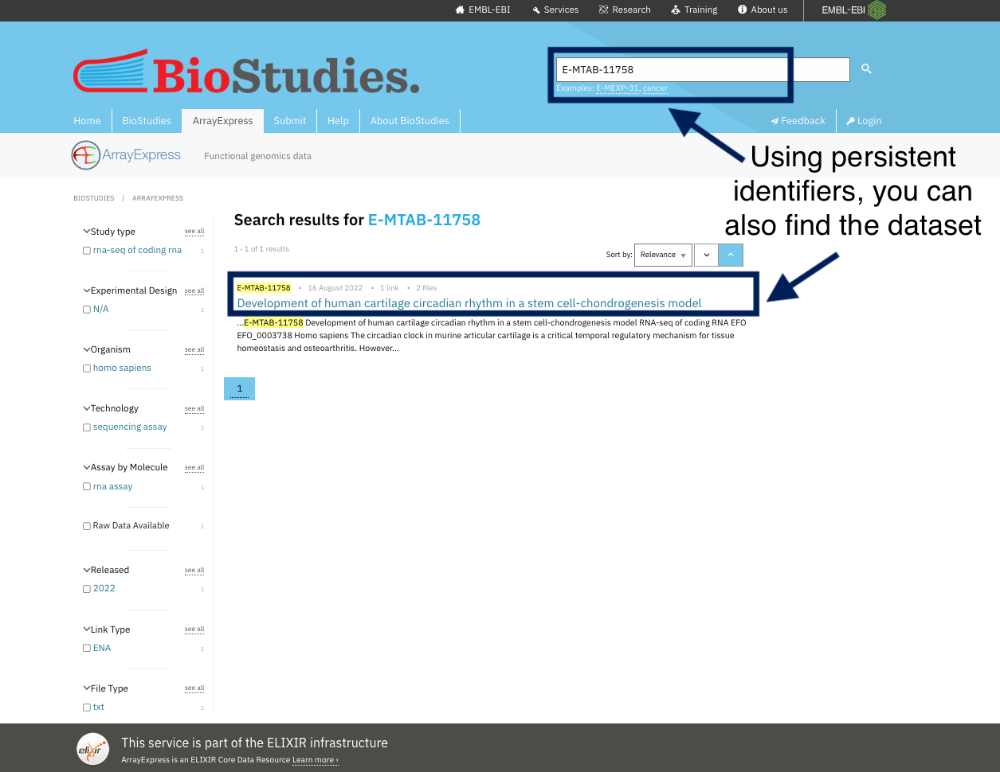
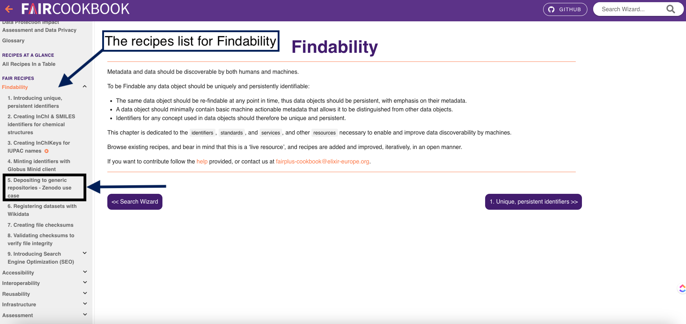
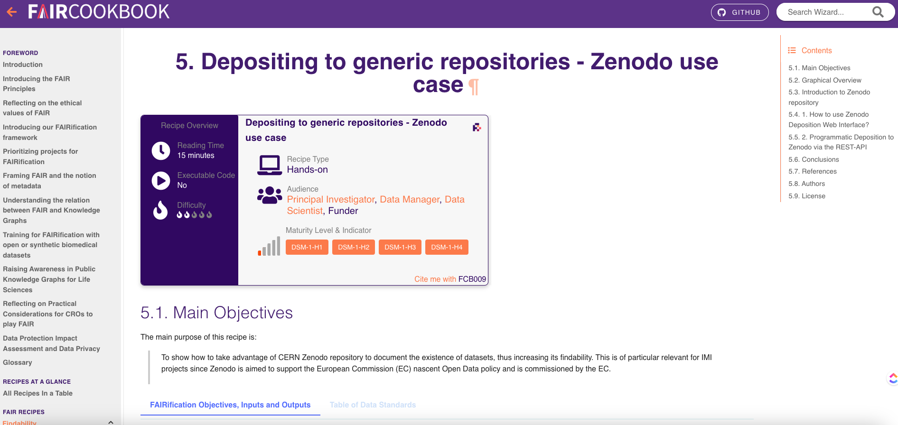

---
title: Registration
teaching: 40
exercises: 10
questions:
- What is a data repository?
- What are types of data repositories?
- Why should you upload your data to a data repository?
- How to choose the right database for your dataset?
objectives:
- Define what is data repository
- Illustrate the importance of indexed data repository
- Summarize the steps of data indexing in a searchable repository
keypoints:
- This episode covers the following FAIR principles:
- (Meta)data are registered or indexed in a searchable resource (F4) 
- (Meta)data are released with a clear and accessible data usage license (R1.1)
--- 
#### What is a data repository?
It is a general term used to describe any storage space you use to deposit data, metadata and any associated research. Kindly note that database is more specific and it is mainly for the storage of your data. 
#### Types of data repository
There are many types of data repsoitory that are classified based on:

**1- The structure of the data:** Data warehouse, Data lake and Data mart

The following table summarize these differences

Data repository                       Data warehouse                Data mart                     Data lake 
---------------                        --------------                ----------                    ------- 
Supported data types                   Structured                 Highly Structured                Structured, Semi-structured, unstructured, binary
Data quality                            curated                   Highly curated                   Raw data 

**2- The purpose of data repository into:** 

A) Controlled access repository

B) Discipline specific repository

C) Institutional repository

D) General data repository

**Figure 1 summarizes these types with different examples**

### Why should you upload your data to a data repository?

To ensure data findability, your data should be uploaded to a public repository where your data can be searched and found, It will make your data comply with the fourth principle of findability (F4) which states that **(Meta)data are registered or indexed in a searchable resource**. There are numerous databases where you can upload your data, which are typically data-driven. 
Examples of these databases are **ArrayExpress** for microarray data and RNAseq data. These databases have a set of rules in place to make sure that your data will be FAIR.

After you upload your data into this database, they are assigned an ID and are indexed in the database. So whenever you look for the ID, or even use a keyword for your data, you will find your data.

Take a look at the **ArrayExpress** database where all datasets are indexed, and you can simply find any dataset using the search tools. By indexing data, you can get the dataset using any keyword other than the PID. For example, if you want to locate human NSCL cell lines, you can just type this into the search toolbox and find the dataset. Indexing and registering datasets, also means they are curated in such a way that you may discover them using different keywords.

##### For example, you can find the same dataset by using its identifiers or by using keywords chosen by the dataset's authors to describe it.

> ## Exercise 1. How to index your dataset?
> One of the things you can do to index your dataset, is to upload it to Zenodo, can you use one of the 
> resources we recommended before to know how to do this?
> [RDMkit](https://rdmkit.elixir-europe.org/), [FAIRcookbook](https://faircookbook.elixir-europe.org/, [FAIRsharing](https://fairsharing.org/)
>> ## Solution
>> Since you want a technical guideline, FAIRcookbook and RDMkit are the best to start with. We will start 
>> with [FAIRcookbook](https://faircookbook.elixir-europe.org/)
>> As we explained before the structure of the recipe so let's look for the suitable recipe in the FAIRcookbook
>> So as you navigate the homepage of FAIRcookbook, you will find different tabs that covers each of FAIR 
>> principles, so for instance, if you want recipes on **Accessibility** of FAIR, you will find all recipes 
>> that can help you make your data accessible. 
>> 
>> - **Follow the following steps to find the recipe:**
>> 
>> 1- In this exercise, we are looking for a recipe on **indexing or registering dataset in a searchable 
>> resource** which you can find it in the findability tab, **Can you find it in this picture?**
>> 
>> 
>> 2- Click on the findability tab
>> 
>> 3- on the left side, you will find a navigation bar which will help you find different recipes that make 
>> your data **findable**. 
>> 
>> 
>> 4- As you can see here, you will find a recipe on registering datasets with Wikidata and another one on 
>> depositing to generic repositories-Zenodo use case
>> **Once you click on one of these resources, you will find the following:**
>> 
>> A) Requirements that you need to apply the recipe to your dataset
>> B) The instructions 
>> C) References and further readings
>> B) Authors and licence
>> 
>> 
>> In our specialized courses, we will give you examples on how to upload your data to specialized repository
> {: .solution}
>
{: .challenge}

### Why should you upload your data to a database?
1- Databases assign your data a unique persistent identifier.

2- Your data will be indexed, making it easier to find.

3- Some databases will let you easily connect your dataset to other datasets.

4- Dataset licencing, with some databases offering controlled or limited access to protect your data.

**By uploading data to a database, you comply with the following FAIR principles**
- **F1** (Meta)data is assigned a globally unique and persistent identifier
- **F3** Metadata clearly and explicitly include the identifier of the data they describe
- **F4** (Meta)data is registered or indexed in a searchable resource
It will also allow your data to be more accessible as the standardized communications protocol and authentication are automatically set for your data
- **A1** (Meta)data is retrievable by their identifier using a standardised communications protocol
- A1.1 The protocol is open, free, and universally implementable
- A1.2 The protocol allows for an authentication and authorisation procedure, where necessary
- **A2** Metadata is accessible, even when the data is no longer available
- **I3** (Meta)data include qualified references to other (meta)data
- **R1.1** (Meta)data is released with a clear and accessible data usage license

#### How to choose the right database for your dataset?
- Check the community standards for your data, you can find more information [RDMkit guidelines](https://rdmkit.elixir-europe.org/your_domain)
- Look for resources that describe the databases and check if it fits your data, you might consider the following:
A) Accessibility options 

B) Licence

- One of these resources is **FAIRsharing**, it provides a registry for different databases and repositories. Here is an example where the FAIR sharing provides you with information regarding protein database [here](https://fairsharing.org/FAIRsharing.rtndct). It has the following information
- General information
- Which policies use this database?
- Related community standards
- Organization maintaining this database
- Documentation and support
- Licence

> ## Resources
> **Our resources provide an overview of data repositories and examples**
> 
> The FAIR cookbook and RDMkit both provide excellent instructions for uploading your data into databases:
> 
> - FAIRcookbook recipe on [Depositing to generic repositories- Zenodo use](https://faircookbook.elixir-europe.> org/content/recipes/findability/zenodo-deposition.html)
> - FAIRcookbook recipe on [Registering Datasets in Wikidata](https://faircookbook.elixir-europe.org/content/
> recipes/findability/registeringDatasets.html)
> - RDMkit guidelines on [Data publications and depostion](https://rdmkit.elixir-europe.org/data_publication)
> - RDMkit guidelines on [Finding and reusing existing data](https://rdmkit.elixir-europe.org/existing_data)
> - FAIRcookbook recipe on [Search engine optimization](https://faircookbook.elixir-europe.org/content/recipes/> findability/seo.html)
> - FAIRsharing offers a nice portal to different [examples of databases](https://fairsharing.org/search?> 
> fairsharingRegistry=Database&subjects=life%2520science&page=1)
{: .callout}

