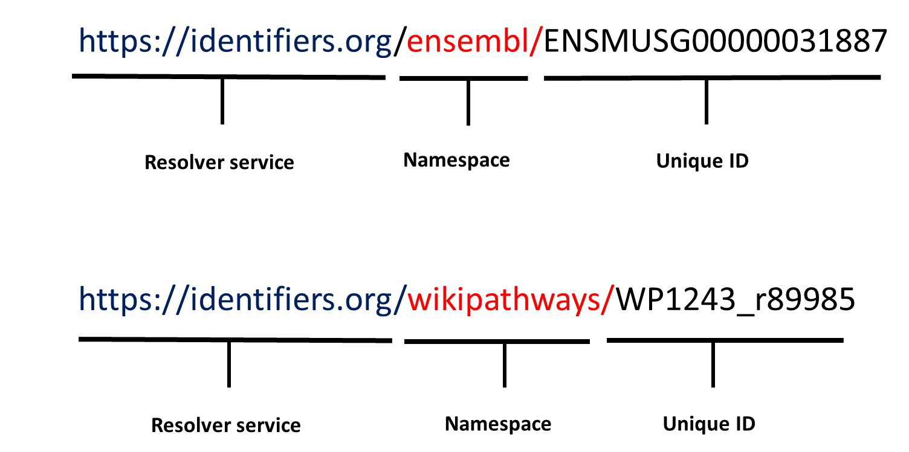

---
title: Persistent identifiers
teaching: 40
exercises: 10
questions:
- What is a persistant identifier?
- What is the structure of identifiers?
- Why it is important for your dataset to have an identifiers?
objectives:
- Explain the definition and importance of using identifiers
- Illustrate what are the persistent identifiers
- Give examples of the structure of persistent identifiers
keypoints:
- FAIR guiding principle adressed (I1) - (Meta)data use a formal, accessible, shared, and broadly applicable language for knowledge representation
- FAIR guiding principle adressed (I3) - (Meta)data include qualified references to other (meta)data
- FAIR guiding principle adressed (A2) - Metadata are accessible, even when the data are no longer available
--- 

## Persistent identifiers (PIDs)

Identifiers are an eternal reference to a digital resource such as a dataset and its metadata, or resources such as publications. They provide the information required to reliably identify, verify and locate your research data. Commonly, a persistent identifier is a unique record ID in a database, or a unique URL that takes a researcher to the data in question, in a database.
Persistent identifiers (PIDs) have to be unique, globally, such that only one resource (dataset, publication) can be identified by this identifier.  In addition to the identifier being unique, it needs to be persistent.  When depositing or hosting data ensure longevity of this persistence by reading specific database policies that may affect reuse of identifiers.  You are looking to avoid something called link rot where the original URL points to a broken link. 
FAIR permits withdrawal of data.  This happens commonly when records are merged or retired.  Relating to this, the second A principle of FAIR states: A2, Metadata are accessible, even when the data are no longer available.  In the context of a persistent identifier, this means the link remains valid and displays all the original metadata of record even though the data is no longer available.
  

Identifiers are an important theme within the FAIR principles, arguably being foundational; they are considered two of the pillars for the FAIR principles, since they are crucial from the **Findable (F)** and **Accessible (A)**.

**It is important to note that when you upload your data to a public repository, the repository will create this ID for you automatically.**

Based on [how to FAIR](https://howtofair.dk/how-to-fair/persistent-identifiers/), there are many resources that can help you find databases to assign PIDs to your data. One of these resources is [FAIR sharing](https://fairsharing.org), providing a list of databases grouped by domains and organisations.

## The Structure of persistent identifiers

To ensure that a PID is globally unique, commonly it is supplied as a unique URL.  For the case of a record in a biological database, the use of a URL ensures that the database record ID is united with the database name.  This protects the uniqueness of the PID from any future scenario where a different database uses the same database record ID for a different dataset.  Since the database name is used as part of the PID (commonly known as the namespace), both this and the record identifier need to be persistent.  If a database changes its name, it must keep the original namespace operational.

Commonly, for things like publications, a DOI is used for the PID, where DOI stands for Digital Object Identifier.  An example is shown below where the PID is constructed from 3 pieces of information: the resolver service, the prefix (namespace) and the suffix (dataset ID).

- **Resolver service**: the domain/service/institution hosting the PID e.g. [https://www.doi.org] (doi.org)
- **Prefix**:  a unique number referring to the publisher.  This is also known as **the namespace**.
- **Suffix**: the unique dataset number

For biological data, commonly PIDs use a different resolver service called identifiers.org.  Examples are given below for 2 different databases, [Ensembl](https://www.ensembl.org/Mus_musculus/Gene/Summary?g=ENSMUSG00000031887;r=8:105984918-105991241) and [WikiPathways](https://www.wikipathways.org/instance/WP1243_r89985), respectively.  **The namespace** is given as the database name in these example.

> ## Exercise 1. Domain specific persistent identifiers
> Use [FAIRsharing](https://fairsharing.org) to find domain specific repository for plant genomics and phenotypes and explore the structure of its persistand identifiers?
>> ## Solution
>> If you follow the steps in the following screen recording, you will find plant genomics and phenotypes. In this database, all datasets are assigned digital object identifier (DOI)
>> <video src="../fig/vid1.mp4" controls="controls" style="max-width: 730px;">
>> </video>
>> The DOI is a persisitent identifiers that follows the structure we explained before
>> 
> {: .solution}
{: .challenge}

> ## Resources
> The resources listed below provide an overview of the information you need to know about identifiers.
> - [Unique and persistent identifiers](https://faircookbook.elixir-europe.org/content/recipes/findability/identifiers.html): this link provide a nice and practical explanation of the unique and persistent identifiers > from FAIRCookbook 
> 
> - [Identifiers](https://rdmkit.elixir-europe.org/identifiers.html): another nice explanation from RDMkit
> 
> - [Machine actionability](https://rdmkit.elixir-europe.org/machine_actionability): identifiers are also 
> important for machine readability, a nice explanation from RDMkit that describes machine readability
> 
> - Examples and explanation of different identifiers from [FAIRsharing.org](https://fairsharing.org/search?recordType=identifier_schema)

{: .callout}

